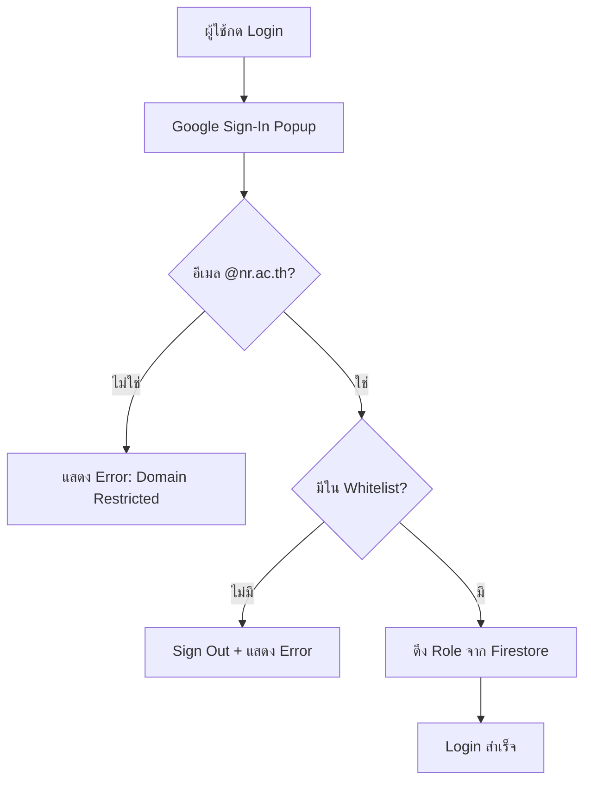
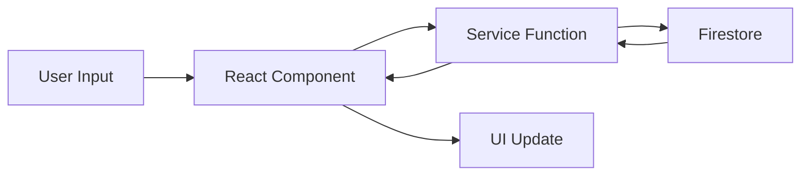

# คู่มือนักพัฒนา - ระบบสถิติการจัดการขยะ

## 📚 สารบัญ

1. [ภาพรวมระบบ](#ภาพรวมระบบ)
2. [โครงสร้างโปรเจกต์](#โครงสร้างโปรเจกต์)
3. [การติดตั้งและเริ่มต้น](#การติดตั้งและเริ่มต้น)
4. [สถาปัตยกรรมระบบ](#สถาปัตยกรรมระบบ)
5. [คู่มือการพัฒนา](#คู่มือการพัฒนา)
6. [API และ Services](#api-และ-services)
7. [การจัดการสิทธิ์](#การจัดการสิทธิ์)
8. [การทดสอบ](#การทดสอบ)
9. [การ Deploy](#การ-deploy)

---

## ภาพรวมระบบ

ระบบสถิติการจัดการขยะเป็นเว็บแอปพลิเคชันสำหรับโรงเรียน เพื่อบันทึกและติดตามข้อมูลการจัดการขยะ

### ฟีเจอร์หลัก
- 🔐 **ระบบ Authentication** - Google Sign-In จำกัดเฉพาะโดเมน @nr.ac.th
- 👥 **User Whitelist** - เฉพาะผู้ใช้ที่ได้รับอนุมัติเท่านั้นที่เข้าใช้งานได้
- 📊 **Dashboard** - แสดงสถิติและกราฟการจัดการขยะ
- ✏️ **CRUD Operations** - เพิ่ม แก้ไข ลบ ข้อมูลการบันทึกขยะ
- 👨‍💼 **User Management** - จัดการผู้ใช้และสิทธิ์ (Admin เท่านั้น)

### เทคโนโลยีที่ใช้
- **Frontend**: React 18 + Vite
- **Styling**: TailwindCSS 3
- **Backend**: Firebase (Authentication + Firestore)
- **Charts**: Recharts
- **Icons**: Lucide React
- **Routing**: React Router DOM

---

## โครงสร้างโปรเจกต์

```
waste-management-system/
├── src/
│   ├── components/          # คอมโพเนนต์ที่ใช้ซ้ำได้
│   │   └── Layout.jsx       # เลย์เอาต์หลัก (Navbar, Footer)
│   │
│   ├── contexts/            # React Contexts
│   │   └── AuthContext.jsx # จัดการ Authentication และ User State
│   │
│   ├── pages/               # หน้าต่างๆ ของแอป
│   │   ├── Dashboard.jsx   # หน้าแสดงสถิติ (Public)
│   │   ├── DataEntry.jsx   # หน้าจัดการข้อมูลขยะ (CRUD)
│   │   ├── Login.jsx       # หน้า Login
│   │   └── UserManagement.jsx # จัดการผู้ใช้ (Admin)
│   │
│   ├── services/            # Firebase Service Functions
│   │   ├── wasteService.js # CRUD สำหรับข้อมูลขยะ
│   │   └── userService.js  # CRUD สำหรับข้อมูลผู้ใช้
│   │
│   ├── App.jsx              # Component หลัก + Routing
│   ├── main.jsx             # Entry Point
│   ├── index.css            # Global Styles + TailwindCSS
│   └── firebase.js          # Firebase Configuration (ไม่อัพ GitHub)
│
├── public/                  # Static Assets
├── .gitignore              # ไฟล์ที่ไม่ต้องการอัพ Git
├── firebase.json           # Firebase Hosting Config
├── package.json            # Dependencies
├── tailwind.config.js      # TailwindCSS Config
├── vite.config.js          # Vite Config
└── README.md               # คู่มือภาษาอังกฤษ
```

---

## การติดตั้งและเริ่มต้น

### ความต้องการของระบบ
- Node.js 18 ขึ้นไป
- npm หรือ yarn
- Firebase Project

### ขั้นตอนการติดตั้ง

1. **Clone Repository**
```bash
git clone https://github.com/kru-yuth/nr-waste.git
cd nr-waste
```

2. **ติดตั้ง Dependencies**
```bash
npm install
```

3. **ตั้งค่า Firebase**

สร้างไฟล์ `src/firebase.js` จาก Template:
```bash
cp src/firebase.example.js src/firebase.js
```

แก้ไขไฟล์ `src/firebase.js` ใส่ค่า Config จาก Firebase Console:
```javascript
const firebaseConfig = {
    apiKey: "YOUR_API_KEY",
    authDomain: "YOUR_PROJECT_ID.firebaseapp.com",
    projectId: "YOUR_PROJECT_ID",
    storageBucket: "YOUR_PROJECT_ID.appspot.com",
    messagingSenderId: "YOUR_MESSAGING_SENDER_ID",
    appId: "YOUR_APP_ID"
};
```

4. **ตั้งค่า Firestore Security Rules**

ไปที่ Firebase Console → Firestore Database → Rules:
```javascript
rules_version = '2';
service cloud.firestore {
  match /databases/{database}/documents {
    match /waste_records/{document=**} {
      allow read: if true;
      allow write: if request.auth != null;
    }
    match /users/{userId} {
      allow read, write: if request.auth != null;
    }
  }
}
```

5. **เพิ่ม Authorized Domains**

Firebase Console → Authentication → Settings → Authorized domains:
- เพิ่ม `localhost` (สำหรับ Development)
- เพิ่มโดเมนจริงหลัง Deploy

6. **สร้าง Firestore Indexes**

เมื่อรันครั้งแรกจะมี Error ขึ้น ให้คลิกลิงก์ที่แจ้งเพื่อสร้าง Index อัตโนมัติ

7. **รันโปรเจกต์**
```bash
npm run dev
```

เปิดเบราว์เซอร์ที่ `http://localhost:5173`

---

## สถาปัตยกรรมระบบ

### Authentication Flow



### Data Flow



### Role-Based Access

| หน้า | Public | User | Admin |
|------|--------|------|-------|
| Dashboard | ✅ | ✅ | ✅ |
| Login | ✅ | ✅ | ✅ |
| Data Entry | ❌ | ✅ | ✅ |
| User Management | ❌ | ❌ | ✅ |

---

## คู่มือการพัฒนา

### การเพิ่มหน้าใหม่

1. สร้างไฟล์ในโฟลเดอร์ `src/pages/`
2. เพิ่ม Route ใน `src/App.jsx`
3. เพิ่มลิงก์ใน `src/components/Layout.jsx` (ถ้าต้องการ)

ตัวอย่าง:
```javascript
// src/pages/NewPage.jsx
import React from 'react';

const NewPage = () => {
    return <div>New Page Content</div>;
};

export default NewPage;

// src/App.jsx
import NewPage from './pages/NewPage';

// เพิ่มใน Routes
<Route path="/new-page" element={<NewPage />} />
```

### การเพิ่มประเภทขยะใหม่

แก้ไขไฟล์ `src/services/wasteService.js`:

```javascript
export const WASTE_CATEGORIES = {
    "Organic": {
        label: "ขยะอินทรีย์",
        subCategories: {
            "Food Waste": { 
                label: "เศษอาหาร", 
                items: ["ชั่งน้ำหนัก", "ขายเป็นอาหารสัตว์"] 
            }
        }
    },
    // เพิ่มประเภทใหม่ที่นี่
    "NewCategory": {
        label: "ประเภทใหม่",
        subCategories: {
            "SubCategory1": {
                label: "ประเภทย่อย 1",
                items: ["รายการ 1", "รายการ 2"]
            }
        }
    }
};
```

### การปรับแต่ง Theme

แก้ไขไฟล์ `tailwind.config.js`:

```javascript
export default {
  theme: {
    extend: {
      colors: {
        primary: {
          50: '#f0fdf4',
          // ... เพิ่มสีอื่นๆ
          600: '#16a34a', // สีหลัก
        }
      }
    }
  }
}
```

---

## API และ Services

### wasteService.js

#### `addRecord(data, userId)`
เพิ่มข้อมูลการบันทึกขยะใหม่

**Parameters:**
- `data` (Object): `{ category, subCategory, itemType, weight }`
- `userId` (String): UID ของผู้บันทึก

**Returns:** `Promise<String>` - Document ID

**ตัวอย่าง:**
```javascript
await wasteService.addRecord({
    category: "Recycle",
    subCategory: "Plastic",
    itemType: "ขวด PET",
    weight: 5.5
}, currentUser.uid);
```

#### `getAllRecords()`
ดึงข้อมูลทั้งหมด เรียงตามวันที่ล่าสุด

**Returns:** `Promise<Array>` - รายการข้อมูลทั้งหมด

#### `getRecordsByYear(year)`
ดึงข้อมูลตามปี

**Parameters:**
- `year` (Number): ปี ค.ศ.

**Returns:** `Promise<Array>` - รายการข้อมูลในปีนั้น

#### `updateRecord(recordId, data)`
แก้ไขข้อมูล

**Parameters:**
- `recordId` (String): ID ของ Record
- `data` (Object): ข้อมูลที่ต้องการอัพเดต

#### `deleteRecord(recordId)`
ลบข้อมูล

**Parameters:**
- `recordId` (String): ID ของ Record

### userService.js

#### `createUser(uid, userData)`
สร้างหรืออัพเดตข้อมูลผู้ใช้

**Parameters:**
- `uid` (String): User ID
- `userData` (Object): `{ email, role, displayName, ... }`

#### `getAllUsers()`
ดึงข้อมูลผู้ใช้ทั้งหมด

**Returns:** `Promise<Array>` - รายการผู้ใช้

#### `updateUserRole(uid, newRole)`
เปลี่ยน Role ของผู้ใช้

**Parameters:**
- `uid` (String): User ID
- `newRole` (String): `"admin"` หรือ `"user"`

#### `deleteUserRecord(uid)`
ลบข้อมูลผู้ใช้จาก Firestore

---

## การจัดการสิทธิ์

### การเพิ่มผู้ใช้ใหม่ (Admin)

1. Login ด้วยบัญชี Admin
2. ไปที่หน้า **User Management**
3. กดปุ่ม **Add User**
4. กรอกอีเมล `@nr.ac.th`
5. เลือก Role (User/Admin)
6. กด Save

### การเปลี่ยน Role

1. ไปที่หน้า **User Management**
2. กดปุ่ม Edit (ดินสอ) ที่ผู้ใช้ที่ต้องการ
3. เลือก Role ใหม่
4. กด Save

### การตั้ง Admin คนแรก

เนื่องจากระบบใช้ Whitelist ต้องเพิ่มข้อมูลใน Firestore ด้วยตนเอง:

1. ไปที่ Firebase Console → Firestore Database
2. เข้า Collection `users`
3. กด **Add document**
4. ใส่ข้อมูล:
   - Document ID: `[UID จาก Authentication]`
   - Fields:
     ```
     email: "admin@nr.ac.th"
     role: "admin"
     displayName: "Admin Name"
     createdAt: [Timestamp]
     ```

---

## การทดสอบ

### Manual Testing Checklist

#### Authentication
- [ ] Login ด้วยอีเมล @nr.ac.th สำเร็จ
- [ ] Login ด้วยอีเมลอื่นถูกปฏิเสธ
- [ ] ผู้ใช้ที่ไม่อยู่ใน Whitelist ถูกปฏิเสธ
- [ ] Logout ทำงานถูกต้อง

#### Data Entry
- [ ] เพิ่มข้อมูลใหม่สำเร็จ
- [ ] แก้ไขข้อมูลสำเร็จ
- [ ] ลบข้อมูลสำเร็จ
- [ ] ค้นหาข้อมูลทำงานถูกต้อง

#### Dashboard
- [ ] แสดงสถิติถูกต้อง
- [ ] กราฟแสดงผลถูกต้อง
- [ ] เปลี่ยนปีแสดงข้อมูลถูกต้อง

#### User Management (Admin)
- [ ] เพิ่มผู้ใช้ใหม่สำเร็จ
- [ ] แก้ไข Role สำเร็จ
- [ ] ลบผู้ใช้สำเร็จ
- [ ] User ธรรมดาเข้าหน้านี้ไม่ได้

---

## การ Deploy

### Firebase Hosting

1. **Build Production**
```bash
npm run build
```

2. **Login Firebase**
```bash
firebase login
```

3. **เลือกโปรเจกต์**
```bash
firebase use nr-nexus
```

4. **ตั้งค่า Target (Multi-site)**
```bash
firebase target:apply hosting waste-app nr-waste-stats
```

5. **Deploy**
```bash
firebase deploy --only hosting:waste-app
```

### Environment Variables

สำหรับ Production ควรใช้ Environment Variables:

1. สร้างไฟล์ `.env.production`
2. ย้าย Firebase Config ไปใช้ `import.meta.env.VITE_*`
3. ตั้งค่าใน Firebase Hosting หรือ CI/CD

---

## การแก้ปัญหาที่พบบ่อย

### 1. Error: auth/unauthorized-domain

**สาเหตุ:** โดเมนไม่ได้รับอนุญาตใน Firebase

**วิธีแก้:**
- ไปที่ Firebase Console → Authentication → Settings → Authorized domains
- เพิ่มโดเมนที่ต้องการ

### 2. Error: The query requires an index

**สาเหตุ:** Firestore ต้องการ Index สำหรับ Query ที่ซับซ้อน

**วิธีแก้:**
- คลิกลิงก์ที่แสดงใน Error
- กดปุ่ม "Create Index"
- รอ 2-5 นาที จนสถานะเป็น "Enabled"

### 3. Loader2 is not defined

**สาเหตุ:** ลืม import

**วิธีแก้:**
```javascript
import { Loader2 } from 'lucide-react';
```

### 4. Firebase Config ไม่ทำงาน

**สาเหตุ:** ใช้ค่า Placeholder

**วิธีแก้:**
- ตรวจสอบไฟล์ `src/firebase.js`
- แทนที่ `YOUR_API_KEY` ด้วยค่าจริงจาก Firebase Console

---

## การมีส่วนร่วม

หากต้องการพัฒนาต่อยอด:

1. Fork Repository
2. สร้าง Feature Branch (`git checkout -b feature/AmazingFeature`)
3. Commit การเปลี่ยนแปลง (`git commit -m 'Add some AmazingFeature'`)
4. Push ไป Branch (`git push origin feature/AmazingFeature`)
5. เปิด Pull Request

---

## ติดต่อ

- **Repository**: https://github.com/kru-yuth/nr-waste
- **โรงเรียน**: NR School

---

## License

MIT License - ดูรายละเอียดใน [LICENSE](LICENSE)
